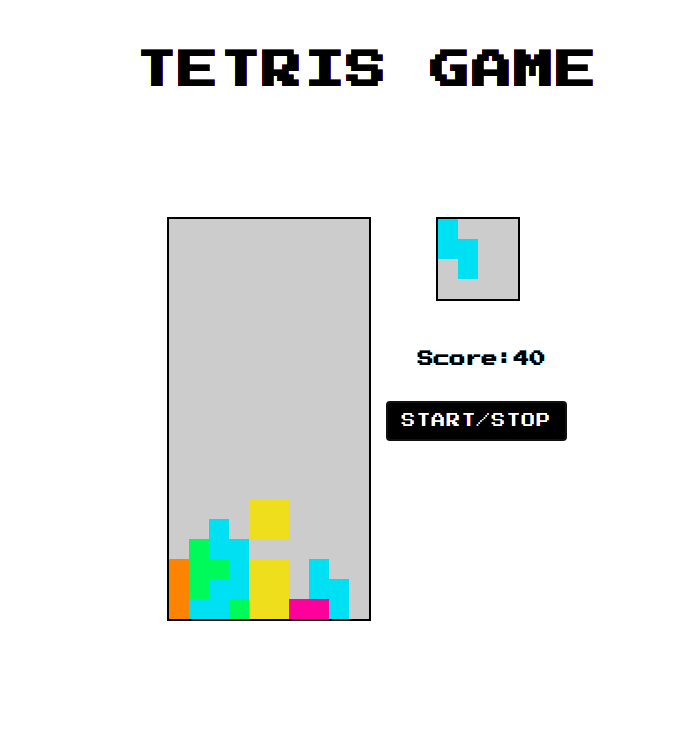

# TetrisGame
## General info
A simple Tetris game written to learn the syntax of the JavaScript programming language. I learned the basics of the language and the built-in methods. While writing, I followed the course from Ania Kubow.

## Technologies
- BasicS of JavaScript
- HTML5
- CSS3 

## Inspiration
https://www.youtube.com/watch?v=rAUn1Lom6dw
